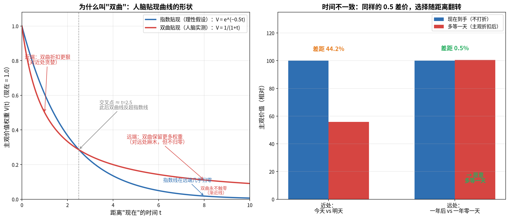

# 赚钱模型（二）：所有利润都是别人的贴现

> 归档日期：2026-08-26
> 来源：思辨讨论整理——延续《赚钱模型：从不确定性开始》中"双曲贴现 × 赚钱"线索，以论述形式成篇（区别于第一篇的对话体）
> 结构骨架：核心概念 → 三场景同构（量化/奸臣/商人）→ 统一律 → 边界与反身性 → 收敛
> 脉络索引见 [README](../README.md)
> 承接：《赚钱模型：从不确定性开始》（顺贴现 vs 逆贴现）、《被拒与信息处理》（鲸鱼 = 掌握模型者）、《读书与时代错位》（知识结构没有贴现到时代需求）

---

## 一、核心概念：人类最普及的定价错误

双曲贴现是人类认知里最普及的定价错误：给"现在"溢价，给"未来"折扣。人们过度高估当下、低估未来，这是由情绪主导的认知误差。

上一轮框架（2026-08-21 追加）把赚钱分成两路：

- **顺贴现**：卖"现在"——借贷分期、订阅制、限时折扣、抽卡、FOMO，在对方热系统状态下定价，赚情绪差；
- **逆贴现**：买被低估的"未来"——复利、长期主义、创业，赚纪律溢价。

收敛句：**顺用它的人做买卖，逆用它的人做复利。**

本篇论证一个更强的命题：量化交易、奸臣上位、商业买卖这三个场景是同构的——它们都在做同一件事：**站在贴现者的对面**。

## 二、量化交易：逆贴现的工业化

交易中，当市场处于非常高的高点时，大家还想追高——量化交易就提供卖出机会；当处于很低的低点时，大家纷纷出仓——量化交易就把它买进来，提供流动性。

量化程序知道人们现在要么低估它、要么高估它，"你想要啥我就给你提供啥"，精准利用了人性"高估现在、低估未来"的漏洞。

拆开看，量化做到这件事靠的是两个前提：

1. **机器不会双曲贴现**——程序没有热系统，追高者的兴奋、割肉者的恐惧，对程序而言只是"另一个人的情绪定价"，是可套利的错价。它不需要预测市场，只需要站在贴现者的对面。
2. **它提供的是流动性，收的是时间差**——高点接住追高者的买盘，低点接住割肉者的卖盘。表面是服务，实质是把对方的"当下溢价/当下折价"变成自己的收入。

这是《被拒与信息处理》中"鲸鱼"的实时版：**谁掌握模型，谁就是鲸鱼；量化是程序化的、无情绪的鲸鱼。**

一句话：量化交易 = 逆贴现的工业化、程序化、规模化。

## 三、奸臣上位：顺贴现的政治版

为什么奸臣总能上位？最重要的机制就是双曲贴现：**你现在想要什么，我就给你提供什么；我不告诉你未来什么东西重要，我可以立马满足你。**

忠臣与奸臣卖的是两种不同的商品：

- **忠臣卖"未来"**：苦口良言、远见、长期治理——都是远期收益，买家（皇帝）必须逆贴现才买得动；
- **奸臣卖"当下"**：顺耳的话、即时的满足、眼前的爽——现买现付，零等待。

在双曲贴现的市场上，**卖当下的人永远有价格优势**——因为买家天生给"现在"溢价。奸臣不是坏在道德，是坏在精准利用了皇帝的贴现率：欲望越急，奸臣的报价越有竞争力。这不是权术，是定价。

推论：**忠臣的悲剧是结构性的，不是运气**——他们卖的是被低估的未来，而市场的定价权握在皇帝的热系统手里。孙少平的困境同构于此：知识结构没有贴现到时代需求（见《读书与时代错位》）。

## 四、统一律：所有利润都是别人的贴现

量化赚价差、奸臣赚权力、商人赚现金——三处应用是同一笔交易：

> **所有利润，都是别人的贴现。**

更精确地说：站在贴现者的对面，把对方的"当下溢价"变成自己的收入。你卖什么不重要——重要的是你站在热系统的哪一边。

## 五、边界与反身性

1. **顺贴现是红海，且有清算风险。** 奸臣的贴现生意有到期日——皇帝的贴现终会以王朝覆灭的形式清算。而且这个市场**无壁垒**：即时供给人人可做，永远有比你更能舔的人入场，所以权臣之间是持续竞价——李林甫之后是杨国忠，严嵩之后有徐阶，范雎之后是蔡泽，同款话术接力从未停止。位子坐不稳不是因为忠臣反击，是因为**同行的贴现率竞标**：为了守住位置，只能不断加大供给的极端程度，形成"贴现螺旋"（李林甫"口蜜腹剑"），直到皇帝被喂麻木、王朝被掏空。奸臣普遍缺乏安全感，正因为他身处一个无壁垒、无终点的竞价市场。反观忠臣，反而是"逆贴现市场"里的稀缺供给——敢说逆耳之言的人少，青史留名是复利，只是当期不被定价。逆贴现赢在复利，但代价是要扛住"被低估"的时期。
2. **反身性：别让自己成为别人的流动性。** 这个框架最实用的地方不是"怎么卖"，而是"怎么不买"。当有人说"你想要啥我立马满足你"——无论是推销、画饼还是情绪价值——要意识到对方在向你收取贴现费。你的每一次"等不了"，都是别人的利润。
3. **个人侧对策**：用承诺机制对抗自己的贴现，"先开始"本身就是反贴现动作（2026-08-21 已述）；同时识别供给者的立场——对方在卖"当下"还是在卖"未来"，决定了你付的是情绪差还是复利。

## 六、收敛

- **奸臣是权术界的量化交易员——都在别人的贴现里做市。**
- **所有利润，都是别人的贴现；你所有的"等不了"，都是别人的利润。**
- 顺用它的人做买卖，逆用它的人做复利，站在对面的人做市。

---

## 附：双曲贴现概念澄清——谁在贴现（2026-08-26 追加）

> 本篇正文把"双曲贴现"当作已知概念使用，此处补上概念地基：**贴现永远发生在"做选择的人"的脑子里，不在供给者身上。**

### 1. 贴现的本源（金融版）

"贴现"原本是金融词：你手里有一张**一年后才值100块的票据**，急着用钱，银行说"现在给你90块，票据归我"，被扣掉的10块就是贴息。为什么扣？因为今天的钱比明天的钱更值钱——现在的100块存一年能变105块，所以"一年后的100块"现在只值95块左右。把未来的价值折算成现在的价值，这个折算动作就叫贴现。**贴现是持有者/买家自己的心理定价，银行只是站在对面收差价。**

### 2. 双曲贴现：人脑的贴现率不恒定

理性人的贴现率恒定（每年固定5%）；人脑不是——**离现在越近的收益，权重越高；离现在越远的收益，折扣越狠**，曲线呈双曲形。经典实验：

- 今天拿100块 vs 明天拿100.5块 → 绝大多数人选今天；
- 一年后拿100块 vs 一年零一天拿100.5块 → 几乎所有人都愿意多等一天。

同样的差价，只因距离不同选择就翻转——这就是**时间不一致**。人不是简单的目光短浅，而是**对近处贪婪、对远处麻木**：今天的爽是1.0权重，十年后的灾难是0.01权重。

**为什么叫"双曲"（数学来源，追加）**：名字来自函数图像的形状——人脑贴现函数 **V(t) = A/(1+kt)** 是反比例形式的双曲线（最典型的双曲线 y = 1/x），图像"近端陡降、远端平缓、永不触零（渐近线）"。对比指数贴现 **V = A·e^(−kt)**：恒定贴现率、处处等比例衰减、远端几乎归零。两条曲线约在 t≈2.5 处交叉——近端双曲折得更狠（对近处贪婪），远端双曲保留更多权重（对远处麻木但不归零）。**贴现率递减**（近端 k → 远端趋 0）正是"对近处贪婪、对远处麻木"的数学表达，也是时间不一致（偏好翻转）能发生的唯一形式——行为科学正是靠"今天 vs 明天"与"一年后 vs 一年零一天"的选择翻转，证明人脑是双曲的。示意图（左图：指数 vs 双曲曲线对比；右图：时间不一致实验）：

经济学建模常用其简化版"β-δ 模型"（现在折扣 β + 未来折扣 δ）表示当下偏好（present bias）。

### 3. 奸臣场景对号入座

| 人物 | 角色 | 行为 |
|------|------|------|
| 皇帝 | 贴现者（做选择的人） | 在"眼前的爽"与"未来的江山"之间选择——给当下溢价，给未来打骨折 |
| 奸臣 | 套利者/供给者 | 看穿皇帝的贴现率，供应"当下满足"——利润 = 皇帝的贴现率 |
| 忠臣 | 吃亏的供给者 | 供应"未来收益"（谏言、远见），但买家给未来打折，卖不上价 |

**回答"谁给谁贴现"：是皇帝在贴现。** 奸臣提供情绪价值只是供给，贴现发生在皇帝心里——他把"此刻的舒服"权重拉到极大，把"未来的代价"权重压到极小。奸臣收的不是情绪价值的钱，是皇帝的贴现率。现代版锚点：限时折扣"今晚结束"——谁在贴现？买家自己；商家只是制造当下的紧迫感。

### 4. 顺贴现/逆贴现的主体区分

- **顺贴现 = 利用别人的贴现**做生意（卖"当下"给贴现者）：奸臣、限时折扣、借贷分期——赚对方的情绪差；
- **逆贴现 = 对抗自己的贴现**（把"未来"买回来）：存钱、坚持、复利、"先开始"——赚纪律溢价。

忠臣是逆贴现的供给面：卖"未来产品"，等远期兑现（青史留名、江山稳固是复利），代价是当期不被定价。

**极简判断标准**：顺贴现 = 拥有现在（立马到手）；逆贴现 = 等一会，但持有未来。判断供给者/决策者的立场只需看一点——对方是让你"现在就拥有"，还是让你"等一会、换未来的持有"。

### 5. 三问检查法

听到"贴现"，问三个问题：① 谁在做"现在 vs 未来"的选择（贴现者）？② 他给未来打了多少折（贴现率）？③ 谁站在他对面靠这个折扣赚钱/吃亏（套利者）？

**贴现螺旋的再澄清**：皇帝是唯一贴现者，奸臣们竞争的是同一笔贴现溢价的额度——谁提供更极端的当下满足，谁就抢到皇帝更多的"现在"权重。不是奸臣在贴现，是奸臣在竞标皇帝的心理折扣。

### 6. 人际版顺贴现：在对方的贴现窗口内供给（追加）

- **初遇只有"当下"一个定价窗口**：萍水相逢时，你的远期价值（人品、能力、长期陪伴）贴现率≈无穷大、权重趋近于零；而"此刻的解决"零折扣入账——提供情绪价值、解燃眉之急，对方直接把"你"与"当下的满足"绑定，印象分被贴现溢价推满。这就是"高看你一眼"的机制。
- **雪中送炭 > 锦上添花**：燃眉之急是贴现率最高的时刻，此时供给享受最大溢价；锦上添花是对方不缺的当下，溢价为零甚至噪音。帮人也要选贴现窗口——帮"更近的事"按原价入账，帮"更远的事"感激被对方的贴现率打折。
- **代价：顺贴现关系的溢价是租赁制，不是买断制**——随时间回落，需持续供给，而"更会提供当下价值"的人随时可竞价（人际版贴现螺旋）。
- **组合拳**：**顺贴现入场（当下价值破冰），逆贴现锁定（长期价值沉淀粘性）**——先用小贴现买入场券，再用逆贴现做复利。与范雎"样品免费（谈外事）→ 正品天价（废太后逐四贵）"同构。
- 收敛：**破冰靠顺贴现，走远靠逆贴现——第一印象是贴现溢价，长期关系是复利。**

### 7. 商业版：按贴现状态细分市场（2×2）（追加）

救急不救远——按客户的贴现状态决定卖"现在"还是卖"未来"：

| 客户状态 \ 你卖什么 | 卖现在（顺贴现） | 卖未来（逆贴现） |
|---|---|---|
| 现在不愁（当下不稀缺） | ✗ 卖不动——无溢价 | ✓ 保险、理财、教育、长期服务 |
| 手忙脚乱（当下稀缺） | ✓ 急救、快消、情绪价值——溢价最高 | ✗ 卖不动——贴现率极高 |

- **保险机制**：卖"未来"给"现在不愁"的人——他们当下有余钱、未来可预测（贴现率低），买的是确定性；手忙脚乱的人永远不买保险（未来权重≈0）。
- **救急不救穷**：急 = 短期危机，卖"现在"是投资——恢复后成为长期客户，这次救急是买入场券；穷 = 长期贴现状态（永远在当下溺水），是无底洞（慈善或坏账）。
- **识客状态 > 产品本身**：卖的不是"保险/急救包"，是"对方贴现率正好不设防的那个方向"。先判断贴现状态，再决定顺卖还是逆卖。
- 收敛：**现在不愁的人买未来，手忙脚乱的人买现在——生意就是找到对方贴现率最高的那个方向，站在对面。**
